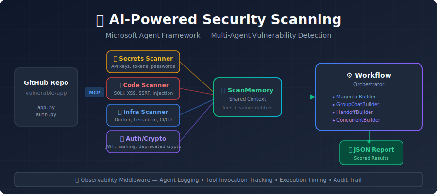
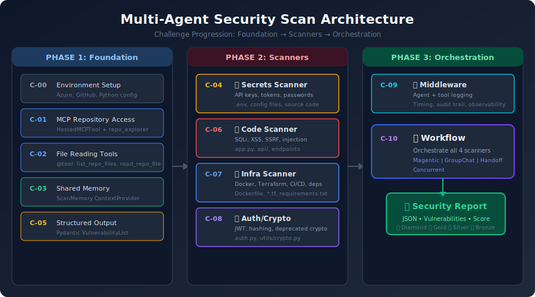

# Agent Framework Security Workshop

Welcome to the Agent Framework Security Workshop! In this hands-on workshop, you will build AI-powered security scanning agents using the **Microsoft Agent Framework** (`agent-framework==1.0.0b260212`) and orchestrate them into a complete vulnerability detection workflow targeting a real GitHub repository.

## Introduction

Get ready to build a multi-agent security scanning system using the **Microsoft Agent Framework**! You will create specialized scanner agents that collaborate to detect hardcoded secrets, code vulnerabilities, infrastructure misconfigurations, and authentication flaws.

Using MCP (Model Context Protocol) for GitHub integration, shared memory for cross-agent coordination, and workflow orchestration patterns, your agents will work together to produce comprehensive, scored security reports.



## Learning Objectives

By the end of this workshop, you will:

- **Build AI agents** with specific security scanning roles and responsibilities
- **Use Model Context Protocol** (MCP) to connect agents to GitHub repositories
- **Share state** between agents using context providers and scan memory
- **Structure agent outputs** with Pydantic models for consistent findings
- **Add observability** with middleware for logging and debugging
- **Orchestrate multiple agents** into a unified scanning workflow

## Architecture



## Requirements

- **Python 3.10+** with pip
- **Azure OpenAI** via API Management (APIM)
- **Azure AI Agent Service** via Service Principal
- **GitHub Personal Access Token**
- **VS Code** (recommended)

Copy the sample environment file and fill in your values:

```bash
cp workshop/.env.sample .env
```

See [.env.sample](.env.sample) for all required variables.

## Getting Started

```bash
git clone <your-repo-url>
cd agent-framework
python -m venv .venv
source .venv/bin/activate
pip install -r requirements.txt
```

Verify your setup by running Challenge 0, then Challenge 1:

```bash
cd workshop/challenge-1
python challenge_01_repo_access.py
```

## Challenges

| Challenge | Title | Duration | Description |
|-----------|-------|----------|-------------|
| [Challenge 0](challenge-0/README.md) | Environment Setup | 20 min | Set up dev environment, configure Azure and GitHub credentials |
| [Challenge 1](challenge-1/README.md) | MCP Repository Access | 15 min | Connect to GitHub via Model Context Protocol |
| [Challenge 2](challenge-2/README.md) | File Reading Tools | 15 min | Create reusable @tool functions for reading repository files |
| [Challenge 3](challenge-3/README.md) | Scan Memory | 20 min | Build a BaseContextProvider for tracking vulnerabilities across agents |
| [Challenge 4](challenge-4/README.md) | Observability Middleware | 15 min | Add logging and observability with middleware chains |
| [Challenge 5](challenge-5/README.md) | Secrets Scanner | 20 min | Detect hardcoded secrets, API keys, and credentials |
| [Challenge 6](challenge-6/README.md) | Structured Output | 15 min | Use response_format with Pydantic models for consistent findings |
| [Challenge 7](challenge-7/README.md) | Code Vulnerability Scanner | 20 min | Find injection, XSS, SSRF, and unsafe code patterns |
| [Challenge 8](challenge-8/README.md) | Infrastructure Scanner | 20 min | Scan Docker, Terraform, CI/CD, and dependency configs |
| [Challenge 9](challenge-9/README.md) | Auth and Crypto Scanner | 20 min | Detect weak hashing, JWT flaws, and deprecated crypto |
| [Challenge 10](challenge-10/README.md) | Orchestrated Workflow | 30 min | Coordinate all scanners into a scored security workflow |

## 🛡️ VULN-HUNT Competition Dashboard

Once you've completed Challenge 10, put your scan to the test in the **live competition**!

### How to Play

1. **Open the link** your instructor shares (e.g. `https://vulnhunt-dashboard.azurewebsites.net`)
2. **Enter the session code** provided by the instructor
3. **Pick a team name** and choose an avatar
4. **Click JOIN GAME** — you'll enter the lobby and wait for the competition to start
5. Once started, **upload your Challenge 10 output** (`.json`) using the upload area
6. Your scan is scored automatically against the vulnerability catalog — the leaderboard updates in real-time
7. You can **re-upload** as many times as you want to improve your score
8. When the competition ends, a **podium screen** shows the top 3 teams

### Tips

- If you get disconnected, just rejoin with the **same team name** — your score is preserved
- Each upload replaces your previous score, so keep improving your scan
- Watch the leaderboard and severity charts to track progress
- The goal: find as many of the **security vulnerabilities** as possible!

## Key References

- [SECURITY_GUIDE.md](SECURITY_GUIDE.md) — Vulnerability knowledge base for crafting scanner instructions
- [expected_workflow_output.json](expected_workflow_output.json) — Target JSON structure for Challenge 10
- [shared_models.py](shared_models.py) — Pydantic models and client factories used by all challenges
- [.env.sample](.env.sample) — Environment variable template

## Resources

- [Microsoft Agent Framework Documentation](https://aka.ms/agent-framework)
- [Model Context Protocol Specification](https://modelcontextprotocol.io/)
- [Azure AI Foundry](https://ai.azure.com/)
- [OWASP Top 10](https://owasp.org/www-project-top-ten/)
